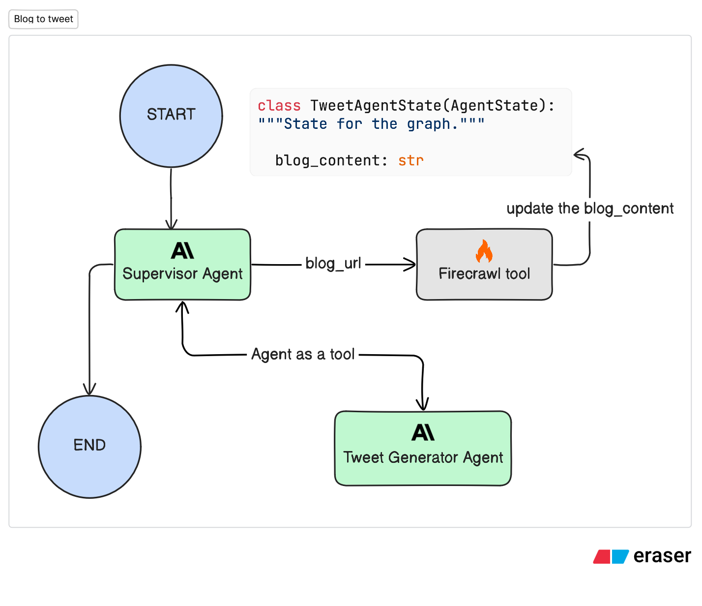

# Blog to Tweet Agent

A LangGraph-powered agent that automatically converts blog posts into engaging Twitter/X threads. Simply provide a blog post URL, and the agent will crawl the content, analyze it, and generate an optimized tweet thread.

## Features

- 🔗 **Automatic Blog Crawling**: Uses Firecrawl to extract clean content from any blog URL
- 🤖 **AI-Powered Generation**: Leverages Claude Sonnet 4.5 for intelligent tweet thread creation
- 📏 **Smart Summarization**: Automatically summarizes long blog posts (>50k chars) before processing
- 🧵 **Optimized Threads**: Generates up to 7 tweets, each under 280 characters
- 🎯 **Structured Output**: Returns well-formatted, ready-to-post tweet threads
- 🔄 **Agent Orchestration**: Uses LangGraph's agent framework with tool-based architecture

## Demo

See the agent in action converting a blog post into an engaging tweet thread:

<p align="center">
  
</p>

## Prerequisites

- Python 3.12 or higher
- [Firecrawl API key](https://firecrawl.dev) - For web scraping
- [Anthropic API key](https://console.anthropic.com/) - For Claude AI model

## Installation

1. **Clone the repository** (if not already done):

   ```bash
   cd agents/blog-to-tweet-agent
   ```

2. **Install dependencies** using `uv` (recommended):

   ```bash
   # Using uv (recommended)
   uv sync

   # Or using pip
   pip install -e .
   ```

   The `uv sync` command will automatically install all dependencies including dev dependencies defined in `pyproject.toml`.

## Configuration

Copy the `.env.example` file to `.env` in the `blog-to-tweet-agent` directory and replace the placeholders with your API keys:

```bash
cp .env.example .env
```

## Usage

### Using LangGraph CLI

1. **Start the development server**:

   ```bash
   langgraph dev
   ```

2. Use the LangGraph Studio UI by opening [https://smith.langchain.com/studio/?baseUrl=http://127.0.0.1:2024](https://smith.langchain.com/studio/?baseUrl=http://127.0.0.1:2024)

3. Alternatively, you can use the [Agent Chat](https://agentchat.vercel.app) to interact with the agent in a chat interface.

### Architecture

The diagram below shows how the supervisor agent orchestrates the workflow between different tools:

<p align="center">
  
</p>

The workflow follows these steps:

- **User** provides a blog URL through a message
- **Supervisor Agent** coordinates the entire workflow
- **Blog Crawler Tool** extracts content using Firecrawl and optionally summarizes if needed
- **Tweet Generator Tool** creates an engaging thread
- **Final Output** is presented to the user as a formatted tweet thread

## Project Structure

```
blog-to-tweet-agent/
├── src/
│   ├── __init__.py          # Package initialization
│   ├── agents.py            # Supervisor agent
│   ├── tools.py             # Tool definitions for Firecrawl and tweet generation
│   ├── graph.py             # LangGraph workflow definition
│   ├── model.py             # LLM configuration (Claude)
│   ├── prompt.py            # All prompts and tool descriptions
│   └── state.py             # State schemas and Pydantic models
├── langgraph.json           # LangGraph configuration
├── pyproject.toml           # Project dependencies
├── .env.example             # Environment variables
```
