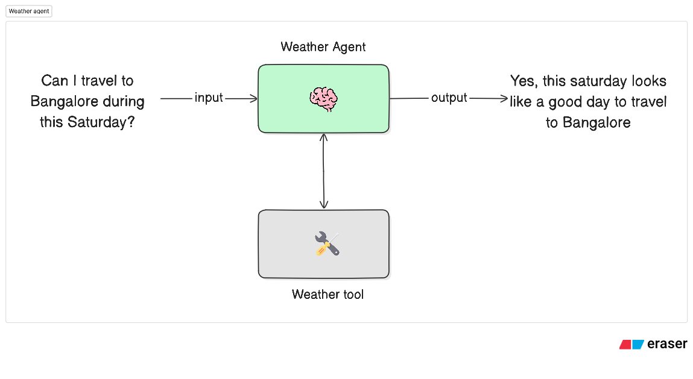

# Weather Agent

A LangGraph-powered intelligent weather assistant that provides accurate forecasts and activity-specific recommendations. Ask about current conditions, plan activities, or check if the weather is suitable for your plans - all with natural language queries.

## Features

- 🌤️ **Real-Time Weather Data**: Uses Open-Meteo API for accurate, up-to-date weather information
- 🎯 **Activity-Based Recommendations**: Get YES/NO answers for activities like "Can I go for football tonight?"
- 📊 **Comprehensive Data**: Current conditions, hourly (24h), and daily (7d) forecasts

## Demo

See the agent in action providing intelligent weather recommendations:

<p align="center">
  
</p>

## Prerequisites

- Python 3.12 or higher
- [Anthropic API key](https://console.anthropic.com/) - For Claude AI model

## Installation

1. **Navigate to the weather agent directory**:

   ```bash
   cd agents/weather-agent
   ```

2. **Install dependencies** using `uv` (recommended):

   ```bash
   # Using uv (recommended)
   uv sync

   # Or using pip
   pip install -e .
   ```

   The `uv sync` command will automatically install all dependencies including dev dependencies defined in `pyproject.toml`.

## Configuration

Create a `.env` file in the `weather-agent` directory with your Anthropic API key:

```bash
# .env
ANTHROPIC_API_KEY=your_anthropic_api_key_here
```

**Note:** Unlike most weather services, Open-Meteo is completely free and doesn't require an API key! 🎉

## Usage

### Using LangGraph CLI

1. **Start the development server**:

   ```bash
   langgraph dev
   ```

2. Use the LangGraph Studio UI by opening [https://smith.langchain.com/studio/?baseUrl=http://127.0.0.1:2024](https://smith.langchain.com/studio/?baseUrl=http://127.0.0.1:2024)

3. Alternatively, you can use the [Agent Chat](https://agentchat.vercel.app) to interact with the agent in a chat interface.

## Architecture

The diagram below shows how the weather agent processes your queries:

<p align="center">
  
</p>

The workflow follows these steps:

- **User** asks a weather-related question through a message
- **Weather Agent** (powered by Claude) analyzes the query to understand location, time, and activity intent
- **Weather Tool** fetches real-time data from Open-Meteo API (current conditions + forecasts)
- **Intelligent Response** is generated with practical recommendations tailored to the user's needs

## Project Structure

```
weather-agent/
├── src/
│   ├── __init__.py          # Package initialization
│   ├── agents.py            # Weather analyst agent
│   ├── tools.py             # Weather tool using Open-Meteo API
│   ├── graph.py             # LangGraph workflow definition
│   ├── model.py             # LLM configuration (Claude)
│   └── prompt.py            # System prompt and tool description
├── langgraph.json           # LangGraph configuration
├── pyproject.toml           # Project dependencies
├── .env                     # Environment variables
└── README.md                # README file
```
