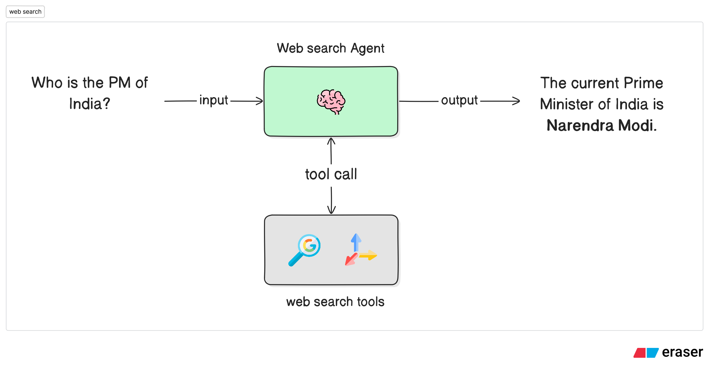

# Web Search Agent

A LangGraph-powered intelligent search assistant that provides accurate, comprehensive, and well-researched answers by leveraging multiple web search APIs. Ask any question and get synthesized information from diverse sources across the internet - all with natural language queries.

## Features

- 🔍 **Dual Search Engine Integration**: Combines results from both Tavily and Google Serper APIs for comprehensive coverage
- 🎯 **Intelligent Synthesis**: Cross-references and validates information across multiple sources
- 📊 **Expert Responses**: Provides well-structured, journalistic-quality answers with source attribution
- ⚡ **Real-Time Information**: Access to current, up-to-date information from the web

## Demo

See the agent in action providing comprehensive search-powered answers:

<p align="center">
  
</p>

## Prerequisites

- Python 3.12 or higher
- [Anthropic API key](https://console.anthropic.com/) - For Claude AI model
- [Tavily API key](https://tavily.com/) - For Tavily search API
- [Serper API key](https://serper.dev/) - For Google search results

## Installation

1. **Navigate to the web search agent directory**:

   ```bash
   cd agents/web-search-agent
   ```

2. **Install dependencies** using `uv` (recommended):

   ```bash
   # Using uv (recommended)
   uv sync

   # Or using pip
   pip install -e .
   ```

   The `uv sync` command will automatically install all dependencies including dev dependencies defined in `pyproject.toml`.

## Configuration

Copy the `.env.example` file to `.env` in the `web-search-agent` directory and replace the placeholders with your API keys:

```bash
# .env
ANTHROPIC_API_KEY=your_anthropic_api_key_here
TAVILY_API_KEY=your_tavily_api_key_here
SERPER_API_KEY=your_serper_api_key_here
```

## Usage

### Using LangGraph CLI

1. **Start the development server**:

   ```bash
   langgraph dev
   ```

2. Use the LangGraph Studio UI by opening [https://smith.langchain.com/studio/?baseUrl=http://127.0.0.1:2024](https://smith.langchain.com/studio/?baseUrl=http://127.0.0.1:2024)

3. Alternatively, you can use the [Agent Chat](https://agentchat.vercel.app) to interact with the agent in a chat interface.

## Architecture

The diagram below shows how the web search agent processes your queries:

<p align="center">
  
</p>

The workflow follows these steps:

- **User** asks any question through a message
- **Web Search Agent** analyzes the query and determines search strategy
- **Dual Search Tools** simultaneously fetch results from:
  - **Tavily API** - Provides detailed content snippets and AI-optimized search results
  - **Google Serper API** - Provides comprehensive Google search results
- **Intelligent Synthesis** cross-references and validates information across both sources
- **Expert Response** is generated with accurate, well-structured answers and source attribution

## Project Structure

```
web-search-agent/
├── src/
│   ├── __init__.py          # Package initialization
│   ├── agents.py            # Web search agent
│   ├── tools.py             # Tavily and Serper search tools
│   ├── graph.py             # LangGraph workflow definition
│   ├── model.py             # LLM configuration (Claude)
│   └── prompt.py            # System prompt and tool descriptions
├── langgraph.json           # LangGraph configuration
├── pyproject.toml           # Project dependencies
├── .env.example             # Environment variables template
└── README.md                # This file
```

## Example Queries

Try asking questions like:

- "What are the latest developments in AI?"
- "How does quantum computing work?"
- "What's the current status of renewable energy adoption?"
- "Compare the features of the latest smartphones"
- "How many funding rounds has Vercel raised, and how much in total? Can you break it down by each series?"

The agent will use both search tools to gather comprehensive information and provide well-researched, synthesized answers.
