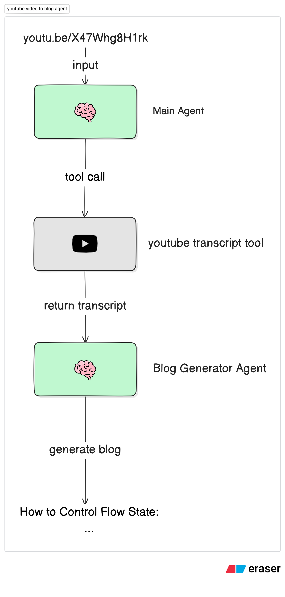

# YouTube Video to Blog Agent

A LangGraph-powered intelligent agent that converts YouTube videos into clear, SEO-friendly Markdown blog posts. Simply provide a YouTube URL, and the agent will fetch the transcript and transform it into a well-structured, professional blog article.

## Features

- 🎥 **YouTube Transcript Extraction**: Automatically fetches video transcripts using Klavis MCP Server
- ✍️ **AI-Powered Content Generation**: Leverages Claude AI to create engaging, well-structured blog posts
- 📝 **SEO-Friendly Format**: Generates complete Markdown articles with proper heading hierarchy
- 🎯 **Comprehensive Structure**: Includes TL;DR, Table of Contents, main content, key takeaways, and FAQs
- 🧹 **Clean Content**: Automatically filters out YouTube-specific filler (sponsor messages, like/subscribe prompts)

## Demo

See the agent in action transforming a YouTube video into a professional blog post:

<p align="center">
  
</p>

## Prerequisites

- Python 3.12 or higher
- [Anthropic API key](https://console.anthropic.com/) - For Claude AI model
- [Klavis API key](https://klavis.ai/) - For YouTube transcript extraction via MCP Server

## Installation

1. **Navigate to the youtube-video-to-blog directory**:

   ```bash
   cd agents/youtube-video-to-blog
   ```

2. **Install dependencies** using `uv` (recommended):

   ```bash
   # Using uv (recommended)
   uv sync

   # Or using pip
   pip install -e .
   ```

   The `uv sync` command will automatically install all dependencies including dev dependencies defined in `pyproject.toml`.

## Configuration

Create a `.env` file in the `youtube-video-to-blog` directory with your API keys:

```bash
# .env
ANTHROPIC_API_KEY=your_anthropic_api_key_here
KLAVIS_API_KEY=your_klavis_api_key_here
```

**Note:** You'll need both API keys for the agent to function properly. Klavis provides MCP Server access for YouTube transcript extraction.

## Usage

### Using LangGraph CLI

1. **Start the development server**:

   ```bash
   langgraph dev
   ```

2. Use the LangGraph Studio UI by opening [https://smith.langchain.com/studio/?baseUrl=http://127.0.0.1:2024](https://smith.langchain.com/studio/?baseUrl=http://127.0.0.1:2024)

3. Alternatively, you can use the [Agent Chat](https://agentchat.vercel.app) to interact with the agent in a chat interface.

## Architecture

The diagram below shows how the YouTube video to blog agent processes your requests:

<p align="center">
  
</p>

The workflow follows these steps:

- **User** provides a YouTube video URL through a message
- **YouTube Video to Blog Agent** analyzes the request and prepares to fetch the transcript
- **Get YouTube Video Transcript Tool** uses Klavis's YouTube MCP Server to extract the video transcript
- **Blog Post Generator** transforms the transcript into a well-structured Markdown blog post with proper formatting
- **Final Output** is a complete blog article with title, TL;DR, table of contents, main content, key takeaways, and FAQs

## Project Structure

```
youtube-video-to-blog/
├── src/
│   ├── __init__.py          # Package initialization
│   ├── graph.py             # LangGraph workflow definition
│   ├── tools.py             # YouTube transcript extraction & blog generator
│   ├── model.py             # LLM configuration (Claude)
│   ├── prompt.py            # System prompts for agent and generator
│   └── state.py             # Agent state definition
├── langgraph.json           # LangGraph configuration
├── pyproject.toml           # Project dependencies
├── .env.example             # Environment variables
└── README.md                # This file
```

## How It Works

1. **Input**: You provide a YouTube video URL
2. **Transcript Extraction**: The agent uses the `get_youtube_video_transcript` tool to fetch the video transcript via Klavis's YouTube MCP Server
3. **Content Processing**: LLM analyzes the transcript and identifies main topics, examples, and key points
4. **Blog Generation**: The `blog_post_generator` creates a comprehensive Markdown blog post following SEO best practices
5. **Output**: You receive a ready-to-publish blog article in Markdown format
